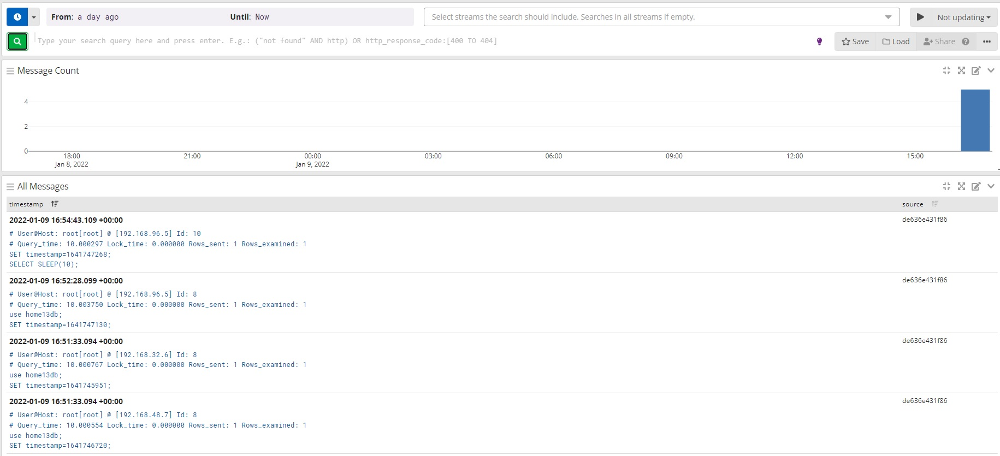
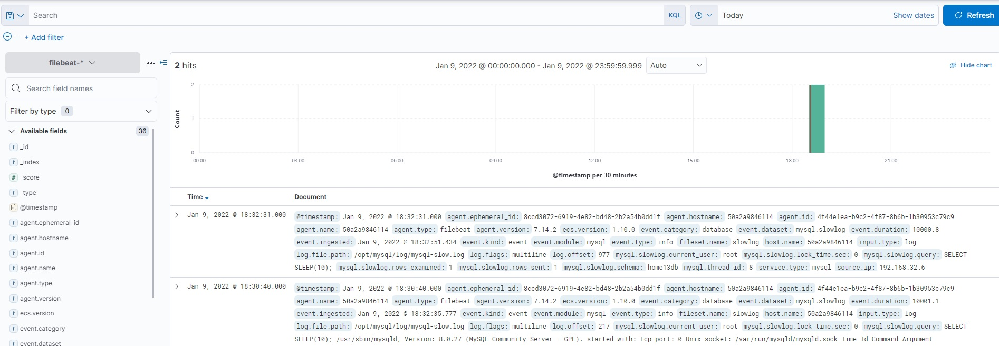

# Run #  
```
docker-compose -f "docker-compose.yml" up -d --build  
```

------------  

# Graylog

### After run docker-compose, you need setup input in WEB-interface graylog and restart filebeat_graylog container.  
See https://docs.graylog.org/docs/docker#quick-start  


# Credential
- for graylog web-interface:  
http://127.0.0.1:9000  
login - admin  
password - admin  

- for mysql web-interface (adminer):  
http://127.0.0.1:8888  
login - admin  
password - admin  
P.S: sample long query time:
```
SELECT SLEEP(3)
```

- for graylog web-interface:  
http://127.0.0.1:5602   

------------  

# Result  
  
 
